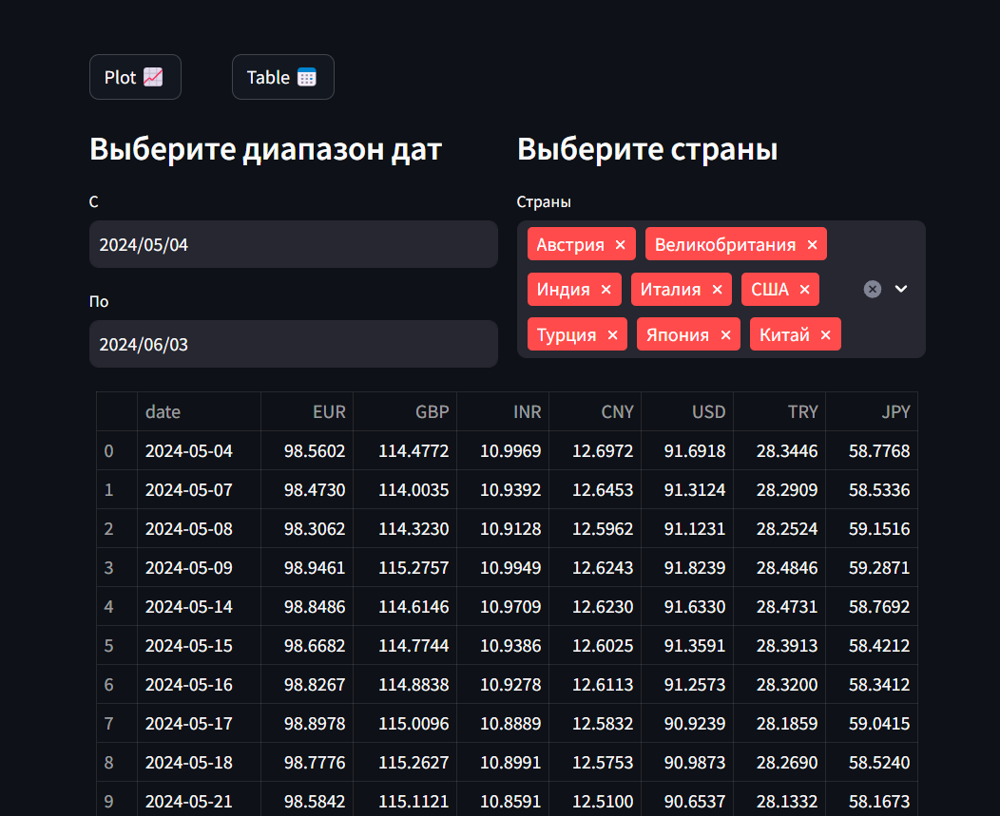
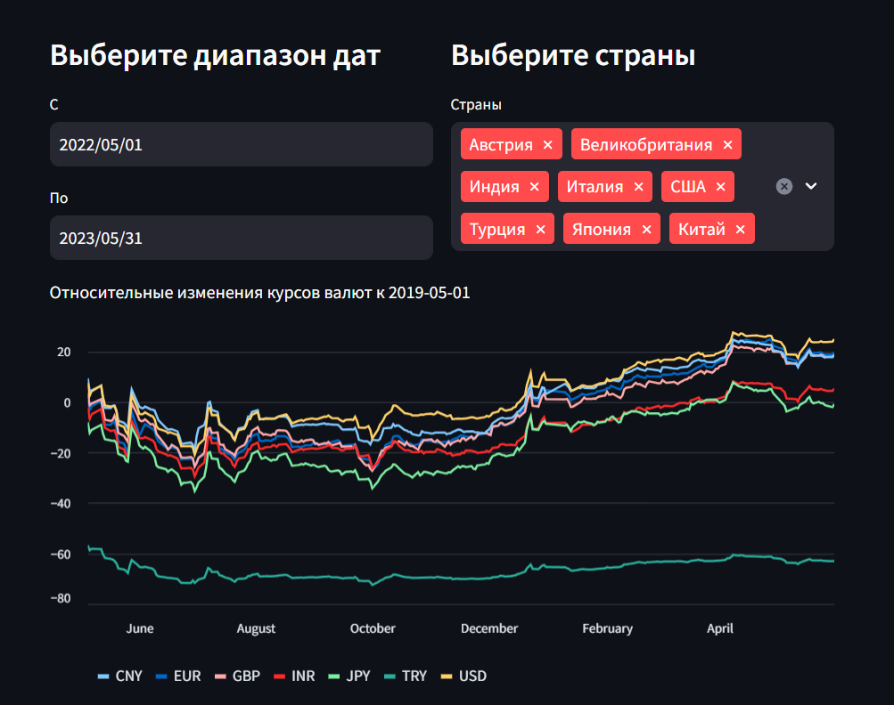

# Currency Rates Web Application

## Overview

This project is a web application that displays exchange rates for various countries. Users can select a date range and the desired way of displaying information. When selecting "Plot," the application generates a graph showing the relative changes in exchange rates compared to the default date specified in the database.




## Features

- Display exchange rates in a tabular format
- View changes in exchange rates as a graph
- Select a date range for historical data
- Data is fetched from [Finmarket](https://www.finmarket.ru) on the first request and cached in an SQLite database
- The list of countries and their main currencies is parsed from [IBAN](https://www.iban.ru/currency-codes) when the application page is refreshed, with only new or modified records being added to the database

## Tech Stack

- **Backend**: Python, SQLite, SQLAlchemy
- **Data Processing**: Pandas, BeautifulSoup
- **Frontend**: Streamlit

## Installation

1. Clone the repository:

    ```bash
    git clone https://github.com/nsstnc/currency_rates.git
    cd currency_rates
    ```

2. Run the setup script to configure the virtual environment and start the project:

    ```bash
    sh setup.sh  # Use `setup.bat` on Windows
    ```

## Usage

1. After running the setup, the browser page should open automatically. If it does not, open your web browser and navigate to `http://localhost:8501`.

## Application Workflow

1. **Initial Setup**:
    - On the first request, exchange rates are parsed from [Finmarket](https://www.finmarket.ru) and saved to an SQLite database.
    - The list of countries and their main currencies is fetched from [IBAN](https://www.iban.ru/currency-codes) and updated in the database if there are new or modified records.

2. **User Interaction**:
    - The user selects a date range within 2 years for which they want to view exchange rates.
    - The user selects the countries whose main currencies they want to see.
    - The user chooses how to display the data: in a table or as a graph.

3. **Data Display**:
    - If the requested data is already in the database, it is retrieved and displayed.
    - If the data is not in the database, it is fetched from Finmarket, saved to the database, and then displayed.

## File Structure
currency_rates/  
├── markdown-images/ # Directory for storing documentation images  
├── data_manager.py # Class for data management  
├── database.db # SQLite database file (created after the first application run)  
├── database.py # Database setup class  
├── main.py # Main application file - Streamlit interface  
├── models.py # Database table models  
├── parser.py # Class implementing data parsing functions  
├── README.md # Project documentation  
├── requirements.txt # List of dependencies  
├── setup.bat # Script to set up the virtual environment and start the project for Windows systems  
├── setup.sh # Script to set up the virtual environment and start the project for UNIX systems  

